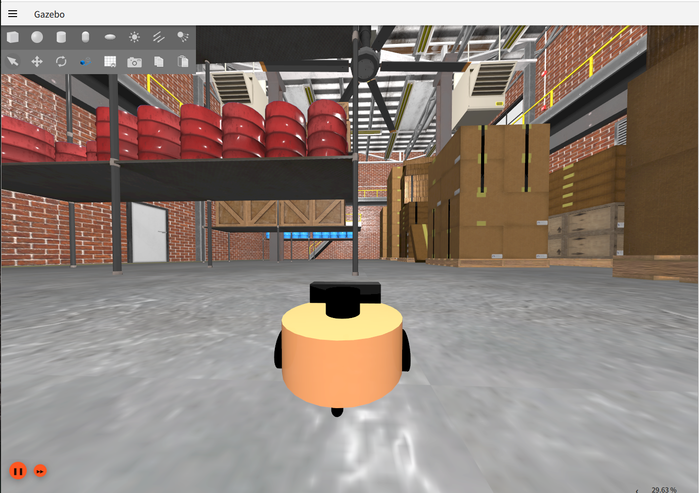
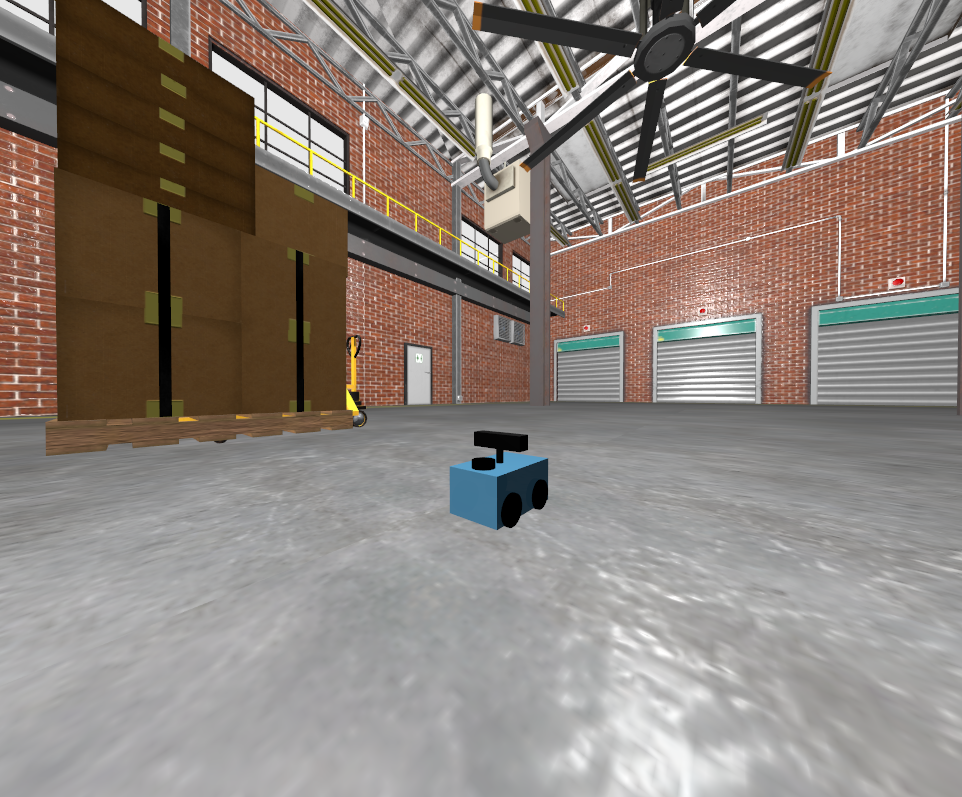
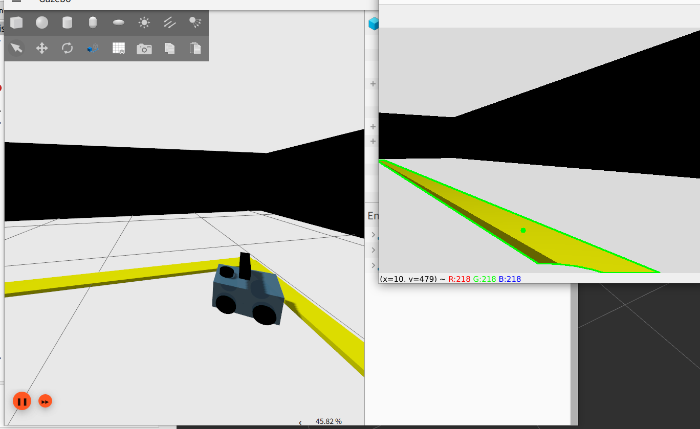
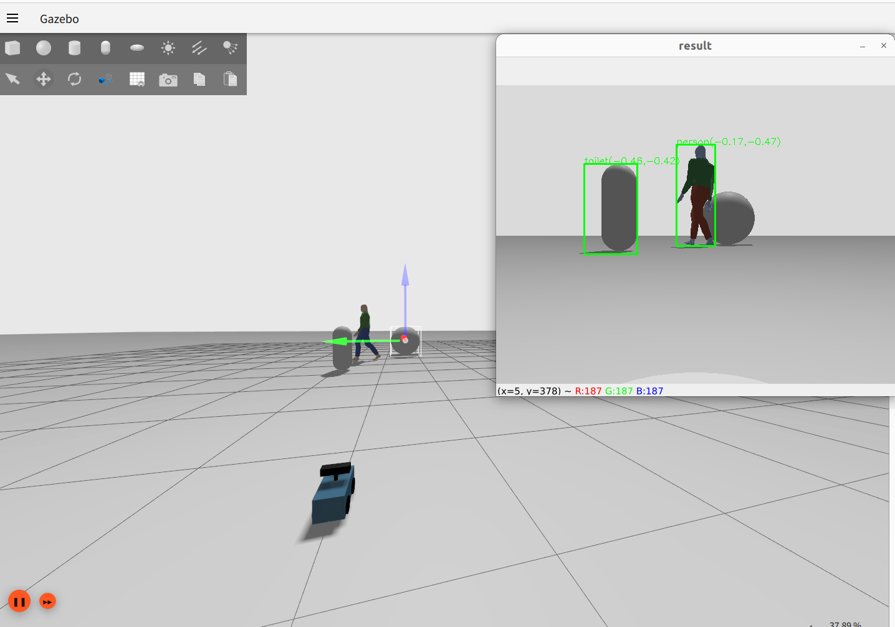
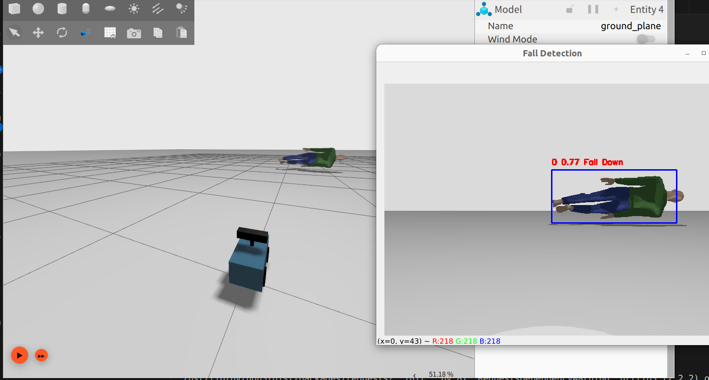
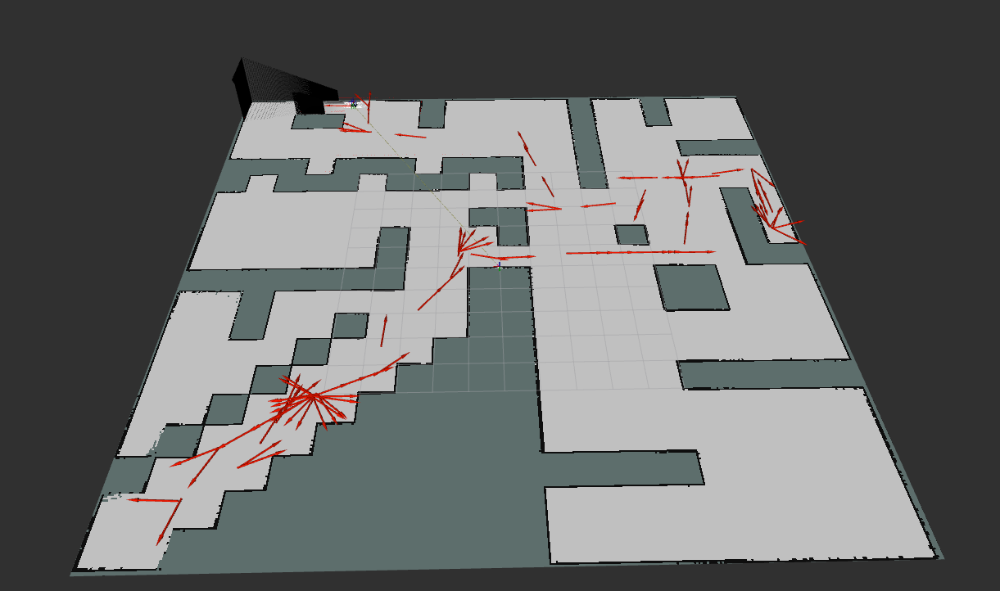
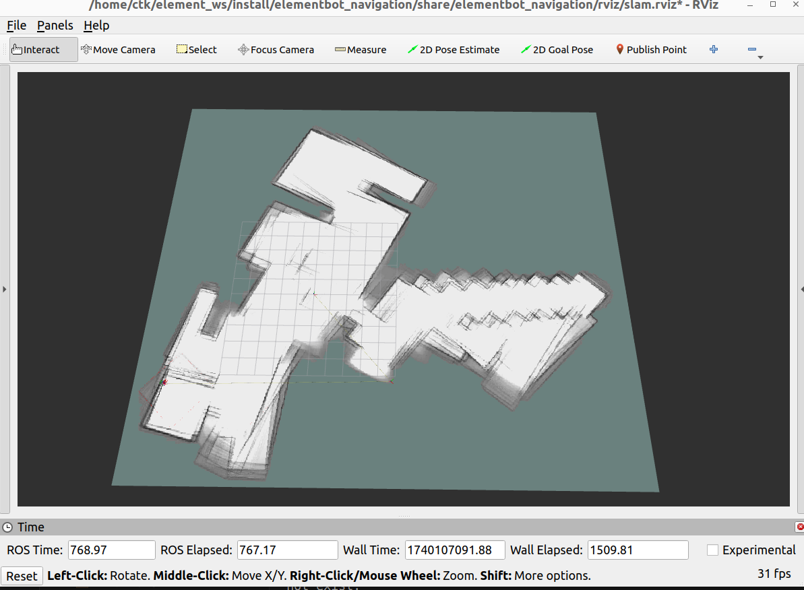
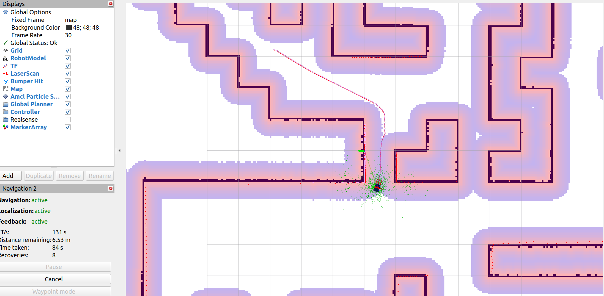

# 這是新版gazebo仿真

## 機器人名：ElementBot

- ### 啟動2W差速機器人

  


  - $``` . install/setup.bash```
  - $ `ros2 launch elementbot_gazebo display_2w_diff_urdf_into_gz.launch.py`
  - $ `ros2 run teleop_twist_keyboard teleop_twist_keyboard`
- ### 啟動４Ｗ差速機器人


  - $``` . install/setup.bash```
  - $ `ros2 launch elementbot_gazebo display_4w_diff_urdf_into_gz.launch.py`
  - $ `ros2 run teleop_twist_keyboard teleop_twist_keyboard`
- ### 尋線自走


  - $ ```. install/setup.bash```
  - $ ```ros2 launch line_follower elementbot_gz_line_follower.launch.py```
- ### yolo5物件偵測

  　。　$ `ros2 run yolov5_ros2 yolo_detect_2d --ros-args -p device:=cpu -p image_topic:=/rgbd_camera/image -p show_result:=True`

  　。　$ `ros2 launch elementbot_gazebo yolo_4w_diff_urdf_into_gz.launch.py`
- iii　參考小魚ros2 [https://github.com/fishros/yolov5_ros2](https://https://github.com/fishros/yolov5_ros2)
- ### yolov5 趺倒偵測


  - $ `ros2 launch elementbot_gazebo yolo_falldown_4w_diff_urdf_into_gz.launch.py`
  - $ `ros2 run yolov5_ros2 fall_down_yolov8 --ros-args -p device:=cpu -p image_topic:=/rgbd_camera/image -p show_result:=True`
- ### Slam Toolbox建圖


  - $ `ros2 launch elementbot_gazebo slamtoolbox_4w_diff_urdf_gz.launch.py`
  - $`ros2 launch slam_toolbox online_async_launch.py`
  - $ `ros2 run teleop_twist_keyboard teleop_twist_keyboard`
- ### **Cartograph建圖**
- $ `ros2 launch elementbot_gazebo cartograph_4w_diff_urdf.launch.py`
- $` ros2 launch elementbot_navigation cartograph_gz.launch.py`
- ### **保存地圖**


  - $ `ros2 run nav2_map_server map_saver_cli -t map -f cloister`
- ### 自主導航


  - $ `ros2 launch elementbot_gazebo slamtoolbox_4w_diff_urdf_gz.launch.py`
  - $ `ros2 launch elementbot_navigation nav2_bringup_gz.launch.py`

# elementbot 備註

#### 如何更換world

1. 加入sdf到world資料夾裡
2. 更改config裡的yam,其中有一行/world/改為模型名稱
3. 更改launch裡啟動world的目標檔
